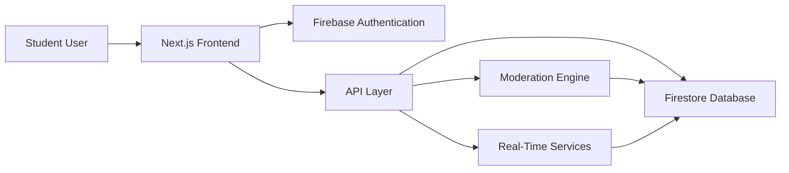

<div align="center">


<br>


<br><br>


</div>

---

# 🌟 About The Project

> **ANONYMOUS** is a next-generation communication platform designed for college communities.

Students can:

✨ Share opinions freely

🎭 Stay anonymous

💬 Interact with seniors & juniors

🚀 Build meaningful discussions

🔒 Maintain privacy

without revealing their real identity.

---

# 🎥 Project Preview

<p align="center">


</p>

---

# ⚡ Features

<table>
<tr>

<td width="50%">

### 🎭 Anonymous Profiles

- Hidden identity
- Random usernames
- Secure mapping

</td>

<td width="50%">

### 💬 Live Discussions

- Real-time messaging
- Dynamic updates
- Instant engagement

</td>

</tr>

<tr>

<td width="50%">

### 🔐 Secure Login

- Google Authentication
- Firebase Auth
- Protected Routes

</td>

<td width="50%">

### 📢 Public Feed

- Anonymous posting
- Community discussions
- Trending content

</td>

</tr>

<tr>

<td width="50%">

### 🚨 Moderation System

- Spam Detection
- Report Abuse
- Safe Environment

</td>

<td width="50%">

### 📱 Responsive UI

- Mobile Friendly
- Tablet Support
- Desktop Optimized

</td>

</tr>

</table>

---

# 🏗 Architecture



---

# 🛠 Tech Stack

<div align="center">

### Frontend


### Backend


### Database


### Tools


</div>

---

# 📊 Repository Analytics

<div align="center">


</div>

---

# 🔥 Core Workflow

```text
User Sign Up
      │
      ▼
Authentication
      │
      ▼
Anonymous Identity Generated
      │
      ▼
Create Post
      │
      ▼
Community Interacts
      │
      ▼
Moderation System
      │
      ▼
Safe Discussion
```

---

---

# 🚀 Quick Start

### Clone Repository

```bash
git clone https://github.com/Akash22-11/ANONYMOUS-.git
```

### Enter Project

```bash
cd ANONYMOUS-
```

### Install Dependencies

```bash
npm install
```

### Run Development Server

```bash
npm run dev
```

---

# 🔐 Environment Variables

```env
NEXT_PUBLIC_FIREBASE_API_KEY=
NEXT_PUBLIC_FIREBASE_AUTH_DOMAIN=
NEXT_PUBLIC_FIREBASE_PROJECT_ID=
NEXT_PUBLIC_FIREBASE_STORAGE_BUCKET=
NEXT_PUBLIC_FIREBASE_MESSAGING_SENDER_ID=
NEXT_PUBLIC_FIREBASE_APP_ID=
```

---

# 🎯 Roadmap

- [x] Authentication
- [x] Anonymous Posting
- [x] Real-Time Feed
- [x] User Profiles

### Upcoming

- [ ] AI Moderation
- [ ] Anonymous Polls
- [ ] Voice Rooms
- [ ] Community Channels
- [ ] Mobile App

---

# 🌎 Open Source Contribution

```bash
Fork 🍴
Clone 📥
Build 🚀
Commit 🔥
Pull Request ⭐
```

---

# 👨‍💻 Developer

<div align="center">


### Akash

Engineering Student • Data Science Enthusiast • Builder

</div>

---

<div align="center">

## ⭐ Star This Repository


</div>


