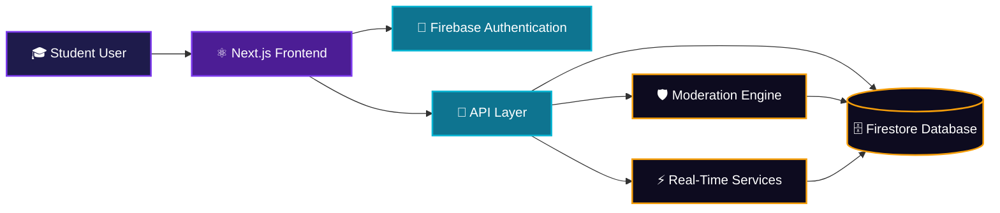
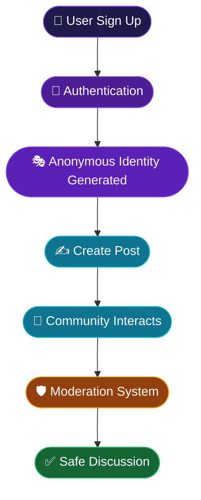

<div align="center">


<br>

<p align="center">
  
  
  
  
</p>

<p align="center">
  
  
  
  
</p>

</div>

<br/>

<div align="center">

### 🧭 Navigate

[About](#-about-the-project) • [Preview](#-project-preview) • [Features](#-features) • [Architecture](#-architecture) • [Tech Stack](#-tech-stack) • [Analytics](#-repository-analytics) • [Quick Start](#-quick-start) • [Roadmap](#-roadmap) • [Developer](#-developer)

</div>


## 🌟 About The Project

> **ANONYMOUS** is a next-generation communication platform designed for college communities — where students speak freely, without fear of judgment.

<table align="center">
<tr>
<td align="center" width="20%">✨<br/><b>Share</b><br/>Opinions Freely</td>
<td align="center" width="20%">🎭<br/><b>Stay</b><br/>Anonymous</td>
<td align="center" width="20%">💬<br/><b>Interact</b><br/>Seniors & Juniors</td>
<td align="center" width="20%">🚀<br/><b>Build</b><br/>Real Discussions</td>
<td align="center" width="20%">🔒<br/><b>Maintain</b><br/>Privacy</td>
</tr>
</table>

<div align="center">

💜 *All without ever revealing your real identity.*

</div>

<br/>

## 🎥 Project Preview

<p align="center">
  
</p>

<br/>

## ⚡ Features

<table>
<tr>
<td width="50%" valign="top">

### 🎭 Anonymous Profiles
- Hidden identity
- Random usernames
- Secure mapping

</td>
<td width="50%" valign="top">

### 💬 Live Discussions
- Real-time messaging
- Dynamic updates
- Instant engagement

</td>
</tr>
<tr>
<td valign="top">

### 🔐 Secure Login
- Google Authentication
- Firebase Auth
- Protected Routes

</td>
<td valign="top">

### 📢 Public Feed
- Anonymous posting
- Community discussions
- Trending content

</td>
</tr>
<tr>
<td valign="top">

### 🚨 Moderation System
- Spam detection
- Report abuse
- Safe environment

</td>
<td valign="top">

### 📱 Responsive UI
- Mobile friendly
- Tablet support
- Desktop optimized

</td>
</tr>
</table>

<br/>

## 🏗 Architecture



<br/>

## 🛠 Tech Stack

<div align="center">

**Frontend**
<br/>


<br/><br/>

**Backend**
<br/>


<br/><br/>

**Database**
<br/>


<br/><br/>

**Tools**
<br/>


</div>

<br/>

## 📊 Repository Analytics

<div align="center">


</div>

<br/>

## 🔥 Core Workflow

<div align="center">



</div>

<br/>

## 🚀 Quick Start

**1️⃣ Clone the repository**
```bash
git clone https://github.com/Akash22-11/ANONYMOUS-.git
```

**2️⃣ Enter the project**
```bash
cd ANONYMOUS-
```

**3️⃣ Install dependencies**
```bash
npm install
```

**4️⃣ Run the development server**
```bash
npm run dev
```

<div align="center">

🎉 Your app should now be running at **`http://localhost:3000`**

</div>

<br/>

## 🔐 Environment Variables

Create a `.env.local` file in the root directory and add:

```env
NEXT_PUBLIC_FIREBASE_API_KEY=
NEXT_PUBLIC_FIREBASE_AUTH_DOMAIN=
NEXT_PUBLIC_FIREBASE_PROJECT_ID=
NEXT_PUBLIC_FIREBASE_STORAGE_BUCKET=
NEXT_PUBLIC_FIREBASE_MESSAGING_SENDER_ID=
NEXT_PUBLIC_FIREBASE_APP_ID=
```

<br/>

## 🎯 Roadmap

**Shipped**
- [x] Authentication
- [x] Anonymous Posting
- [x] Real-Time Feed
- [x] User Profiles

**Upcoming**
- [ ] 🤖 AI Moderation
- [ ] 📊 Anonymous Polls
- [ ] 🎙️ Voice Rooms
- [ ] 🏘️ Community Channels
- [ ] 📱 Mobile App

<br/>

## 🌎 Open Source Contribution

<div align="center">

| Step | Command |
|------|---------|
| 🍴 Fork | Fork the repo to your account |
| 📥 Clone | `git clone <your-fork-url>` |
| 🌿 Branch | `git checkout -b feature/your-feature` |
| 🚀 Build | Make your changes & test locally |
| 🔥 Commit | `git commit -m "Add: your feature"` |
| ⭐ PR | Open a Pull Request |

</div>

<br/>

## 👨‍💻 Developer

<div align="center">


### Akash

**Engineering Student • Data Science Enthusiast • Builder**


</div>

<br/>


<div align="center">

## ⭐ Star This Repository


<br/>


<sub>Made with 💜 for college communities everywhere</sub>

</div>
