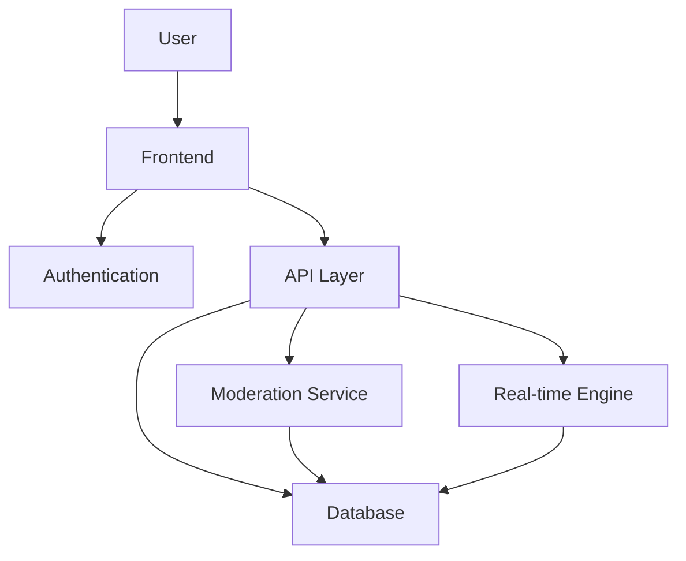

<div align="center">

# 🎭 ANONYMOUS
### Connect. Share. Express. Anonymously.

<p align="center">
  A secure and engaging anonymous communication platform designed for college communities.
</p>

<p align="center">
  
  
  
  
</p>

---

### 🚀 Live Demo

🔗 **[Visit Website](YOUR_DEPLOYMENT_LINK)**

</div>

---

# ✨ Overview

ANONYMOUS is a modern web platform that allows students to interact, ask questions, share opinions, and communicate freely without revealing their identity.

Built with privacy-first principles, the platform encourages honest conversations while maintaining a safe and moderated environment.

---

# 🌟 Key Features

### 👤 Anonymous Identity System
- No real names displayed
- Randomized user identities
- Privacy-focused interactions

### 💬 Real-Time Discussions
- Instant message updates
- Dynamic conversation threads
- Community engagement

### 🔒 Secure Authentication
- Email Authentication
- Google Login
- Protected Routes

### 📢 Public Confession Feed
- Share thoughts anonymously
- Community reactions
- Trending discussions

### 🧠 Smart Moderation
- Spam prevention
- Toxicity filtering
- Content reporting system

### ❤️ Community Interaction
- Likes & Reactions
- Replies
- Threaded conversations

### 📱 Responsive Design
- Mobile Friendly
- Tablet Optimized
- Desktop Experience

---

# 🏗️ System Architecture



---

# 🛠️ Tech Stack

## Frontend

- ⚛️ React.js / Next.js
- 🎨 Tailwind CSS
- 🧩 TypeScript
- 🔥 Firebase SDK

## Backend

- Node.js
- Express.js
- Firebase Functions

## Database

- Firestore Database

## Authentication

- Firebase Authentication
- Google OAuth

## Deployment

- Vercel
- Firebase Hosting

---

# 📂 Project Structure

```bash
ANONYMOUS/
│
├── src/
│   ├── app/
│   ├── components/
│   ├── hooks/
│   ├── lib/
│   ├── services/
│   ├── types/
│   └── utils/
│
├── public/
│
├── firebase/
│
├── docs/
│
└── README.md
```

---

# 📸 Screenshots

## Landing Page


## Dashboard


## Anonymous Feed


## User Profile


---

# 🚀 Getting Started

### Clone Repository

```bash
git clone https://github.com/Akash22-11/ANONYMOUS-.git
```

### Move Into Project

```bash
cd ANONYMOUS-
```

### Install Dependencies

```bash
npm install
```

### Start Development Server

```bash
npm run dev
```

---

# ⚙️ Environment Variables

Create a `.env.local` file.

```env
NEXT_PUBLIC_FIREBASE_API_KEY=
NEXT_PUBLIC_FIREBASE_AUTH_DOMAIN=
NEXT_PUBLIC_FIREBASE_PROJECT_ID=
NEXT_PUBLIC_FIREBASE_STORAGE_BUCKET=
NEXT_PUBLIC_FIREBASE_MESSAGING_SENDER_ID=
NEXT_PUBLIC_FIREBASE_APP_ID=
```

---

# 🔐 Security Features

- Protected Authentication
- Anonymous User Mapping
- Firestore Security Rules
- Input Sanitization
- Rate Limiting
- Abuse Detection
- Spam Prevention

---

# 🎯 Future Roadmap

- [ ] Anonymous Voice Messages
- [ ] AI Moderation
- [ ] Community Channels
- [ ] Dark Mode Enhancements
- [ ] Anonymous Polls
- [ ] College Verification
- [ ] Achievement System
- [ ] Mobile Application

---

# 📊 Project Goals

- Promote healthy anonymous communication
- Help juniors interact with seniors
- Encourage open discussions
- Build a safer college community

---

# 🤝 Contributing

Contributions are welcome!

```bash
Fork 🍴
Clone 📥
Create Branch 🌱
Commit Changes 🚀
Open Pull Request 🔥
```

---

# 👨‍💻 Author

### Akash

Passionate Developer • Open Source Enthusiast • Engineering Student

<p align="left">
  <a href="YOUR_LINKEDIN">LinkedIn</a> •
  <a href="YOUR_GITHUB">GitHub</a>
</p>

---

<div align="center">

### ⭐ If you like this project, don't forget to star the repository!

**Built with ❤️ for the student community**

</div>
